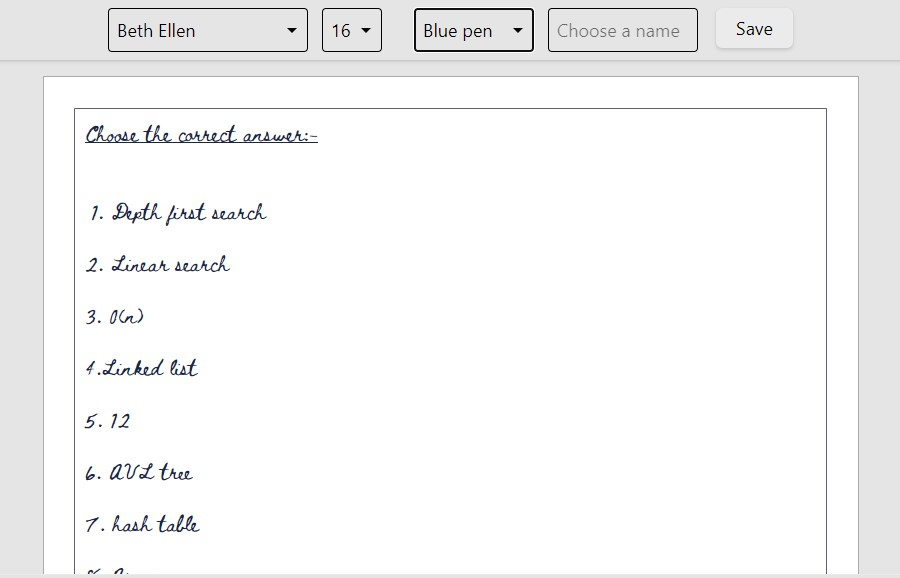

<p align="center">
    
</p>
<h1 align="center">
  For Last Minute Guys (FLMG)
</h1>
<p align="center">
Editor For Last Minute Guys, generates images or pdf from the text
</p>

<p align="center">
    
</p>

## 🚀 Quick start

1.  **Clone repo.**

   
    ```shell
    npm install -g gatsby-cli 
    npm install
    ```

1.  **Start developing.**

    Navigate into your new site’s directory and start it up.

    ```shell
    cd FLMG/
    gatsby develop
    ```

1.  **Open the source code and start editing!**

    Your site is now running at `http://localhost:8000`!

    _Note: You'll also see a second link: _`http://localhost:8000/___graphql`_. This is a tool you can use to experiment with querying your data. Learn more about using this tool in the [Gatsby tutorial](https://www.gatsbyjs.com/tutorial/part-five/#introducing-graphiql)._

    Open the `FLMG` directory in your code editor of choice and edit `src/pages/index.js`. Save your changes and the browser will update in real time!
